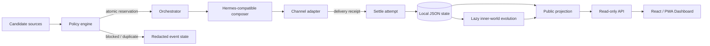

# Hina Companion System

一个面向 Hermes Agent 的本地优先、隐私优先的主动式 AI 陪伴编排系统。

它解决的不是“再做一个聊天页面”，而是主动 Agent 真正落地时更麻烦的工程问题：多个定时任务如何共享频控、并发 tick 如何避免重复发送、一次调度尝试怎样与真实送达分离、长期状态如何跨会话演进，以及 Dashboard 如何展示运行状态而不泄露私人内容。

> 本仓库是从个人本地系统中重新整理的 clean-room 公开实现。示例数据均为虚构；不包含真实聊天、记忆、账号、密钥、声音样本或运行日志。

本项目不复制 Hermes 源码：Hermes 提供 Agent Runtime，本仓库只实现陪伴编排、状态演进、隐私投影、Dashboard 和部署组合层。详细边界见 [CUSTOMIZATIONS.md](CUSTOMIZATIONS.md)，固定的上游版本见 [`upstream.lock`](upstream.lock)。

## 工程亮点

- 共享非对称冷却矩阵：任务提醒可比低优先级 check-in 更快穿透，同时避免多种主动消息连续轰炸
- Attempt / Sent 两阶段语义：调度通过只创建带过期时间的 reservation，只有适配器回执成功才推进全局 `last_sent_at`
- 并发安全：基于 `flock` 的进程锁与原子 JSON 替换，避免多个 cron tick 同时放行
- 幂等与去重：候选消息可携带 `dedupe_key`，重复计划被稳定跳过
- 懒加载状态演进：内在状态在读取时按离线天数追赶，无需常驻漂移进程，并限制最大 catch-up 天数
- 可测试的 adapter 边界：策略核心不依赖网络，Hermes/OpenAI-compatible API、消息渠道和 TTS 都位于适配器层
- 隐私最小化：审计状态不保存正文或原始上下文，Dashboard 只消费 public projection
- 可视化 Dashboard：React + TypeScript + Vite + PWA，后端不可用时自动降级到脱敏 demo 数据
- 发布安全：`.gitignore`、环境变量模板、自定义 secret scan 与 GitHub Actions CI

## 架构



更完整的状态机和设计取舍见 [docs/ARCHITECTURE.md](docs/ARCHITECTURE.md)。

## 主动消息生命周期

1. 提醒、文章推荐、自然 check-in 或网页消息生成一个 `Candidate`
2. `PolicyEngine.evaluate_and_reserve()` 在同一把文件锁内检查去重、进行中 reservation、attempt 重试冷却和全局共享冷却
3. 只有 `send` 决策才调用 LLM 或 TTS，避免被阻塞时浪费模型调用
4. 渠道适配器返回 `DeliveryReceipt`
5. `settle()` 把 attempt 置为 `sent` 或 `failed`
6. 仅成功回执更新 `last_sent_at`；失败不会伪造“已经联系过用户”的状态
7. Dashboard 从脱敏投影读取状态，不接触消息正文

## 目录结构

```text
.
├── src/hina_companion/
│   ├── policy.py          # 冷却、reservation、attempt/sent 状态机
│   ├── store.py           # 文件锁与原子 JSON 存储
│   ├── orchestrator.py    # composition → delivery → settle 闭环
│   ├── inner_world.py     # 跨天懒演进的持久状态
│   ├── adapters.py        # FakeChannel 与 Hermes API 适配器
│   ├── tasks.py           # 到期任务筛选
│   ├── redaction.py       # 日志/投影脱敏
│   ├── dashboard.py       # public projection
│   ├── api.py             # localhost-only 只读 API
│   └── tts.py             # 可选 TTS 适配器
├── dashboard/             # React + TypeScript + Vite PWA
├── docker/                # Dashboard 反向代理配置
├── tests/                 # 策略、状态、脱敏、任务与闭环测试
├── Dockerfile             # 自研 API 与 Dashboard 镜像
├── docker-compose.yml     # 与官方 Hermes 镜像组合运行
├── CUSTOMIZATIONS.md      # 上游与自研边界
├── upstream.lock          # 已核对的 Hermes 上游版本
├── scripts/secret_scan.py
├── config.example.yaml
└── docs/
```

## 快速开始

需要 Python 3.11+ 和 Node.js 20+。

```bash
git clone <your-repository-url>
cd hina-companion-system

python -m venv .venv
source .venv/bin/activate
pip install -e '.[dev]'

pytest -q
python scripts/secret_scan.py .
hina-companion demo --state-dir ./data
```

启动只读 API：

```bash
hina-dashboard-api
# http://127.0.0.1:8787/api/dashboard
```

另开一个终端启动前端：

```bash
cd dashboard
npm ci
npm run dev
# http://127.0.0.1:5173
```

Vite 会将 `/api` 代理到 Python API。API 不可用时，Dashboard 会自动回退到脱敏演示状态。

### Docker Compose

```bash
cp .env.example .env
# 将 .env 中的 HERMES_API_KEY 替换为本地生成的随机值
docker compose up -d --build
```

然后访问 `http://127.0.0.1:8080`。Hermes 状态和 Companion 状态分别保存在独立命名卷中；真实记忆、人格和平台凭证不会进入镜像或 Git。

## Hermes Agent 集成

复制环境变量模板并只在本机填写密钥：

```bash
cp .env.example .env
```

```env
HERMES_API_URL=http://127.0.0.1:8642
HERMES_API_KEY=<set-locally>
TTS_ENDPOINT=http://127.0.0.1:9880/tts
```

`HermesOpenAIAdapter` 使用 OpenAI-compatible `/v1/chat/completions` 接口完成文本 composition。生产任务应在 gate 返回 `send` 后才调用它，并把实际渠道回执交给 `settle()`。Hermes cron 集成建议见 [examples/cronjobs.md](examples/cronjobs.md)。

## 质量保障

```bash
ruff check src tests scripts
pytest -q
python scripts/secret_scan.py .

cd dashboard
npm run lint
npm run build
```

CI 同时执行 Python 测试、静态检查、敏感信息扫描和前端生产构建。

## 隐私边界

公开仓库永远不应包含：

- 会话记录、私人记忆、用户画像和消息正文
- 账号/频道 ID、API key、token、cookie 或真实 `.env`
- 本地绝对路径、内网地址、生产日志、状态快照和备份
- 私人提醒内容、学习/生活记录、生产 persona prompt
- 声音参考样本和生成音频

详细威胁边界与发布检查见 [docs/PRIVACY.md](docs/PRIVACY.md)。

## 当前边界

- 公共 API 目前只读，并只绑定 `127.0.0.1`
- Dashboard 的 Gateway 控制按钮仍为安全 mock；仓库不会直接执行启动、停止或重启命令
- 示例不绑定某一个消息平台，真实渠道由 `ChannelAdapter` 实现
- JSON + `flock` 适合单机部署；多机并发应替换为带事务和唯一约束的数据库

## 文档

- [架构与状态机](docs/ARCHITECTURE.md)
- [隐私与发布边界](docs/PRIVACY.md)
- [部署说明](docs/DEPLOYMENT.md)
- [上游与自研边界](CUSTOMIZATIONS.md)
- [Hermes cron 集成示例](examples/cronjobs.md)

## License

MIT
