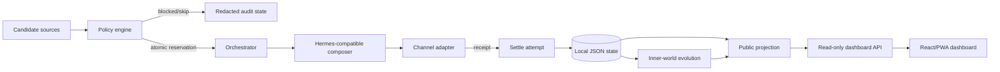
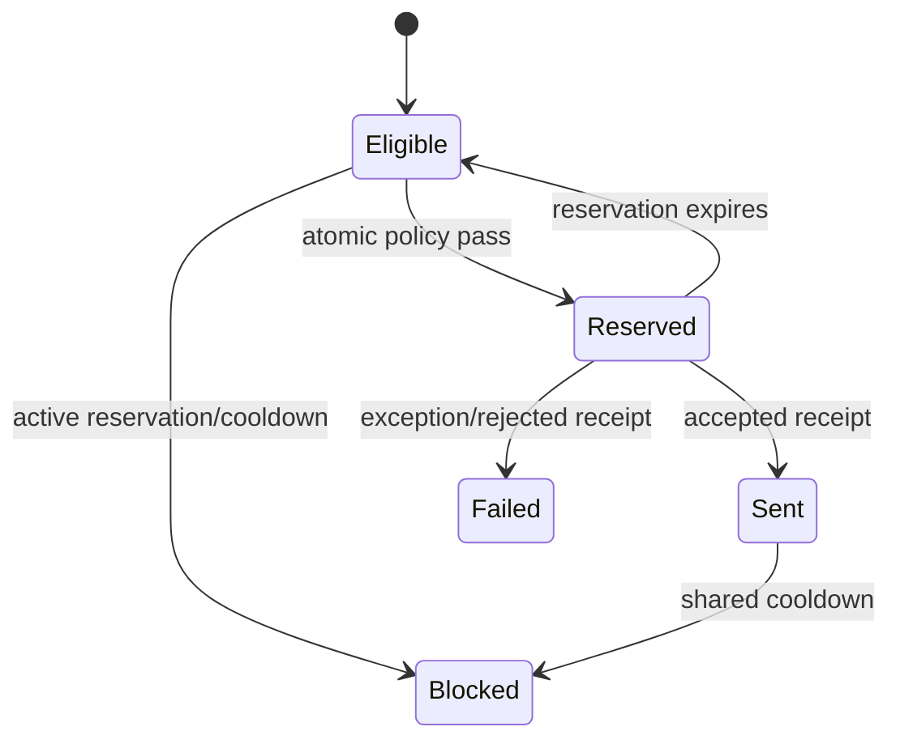

# Architecture

## Data flow

## Key design decisions

### 1. Attempt and sent are different states

A scheduler decision is not delivery success. The policy engine first reserves an attempt under a file lock. Only an accepted channel receipt advances `last_sent_at`, which prevents a timeout from creating a false global cooldown.

### 2. Shared asymmetric cooldown

All proactive sources use one matrix. A due reminder may pass sooner after a low-priority source, while ambient check-ins wait longer after any recent proactive message. The matrix is validated at startup; incomplete policy fails closed.

### 3. Atomic reservation before expensive work

Concurrent cron ticks can race. `evaluate_and_reserve` performs eligibility checks and writes an expiring reservation in one locked state transition. Composition and TTS happen only after eligibility, reducing duplicate sends and wasted model calls.

### 4. Local-first state, public projection

Runtime state uses atomic JSON replacement and advisory file locks. Dashboard responses expose counts, labels and delivery metadata—not message bodies, private memories or raw prompts.

### 5. Lazy inner-world drift

The state advances when read rather than requiring a dedicated always-on process. Offline days are caught up with a bounded loop. This creates continuity while keeping the mechanism deterministic and testable.

### 6. Adapter boundary

Hermes/OpenAI-compatible composition, messaging delivery and TTS are adapters. The core policy has no network dependency and can be tested with `FakeChannel`.

## State machine

